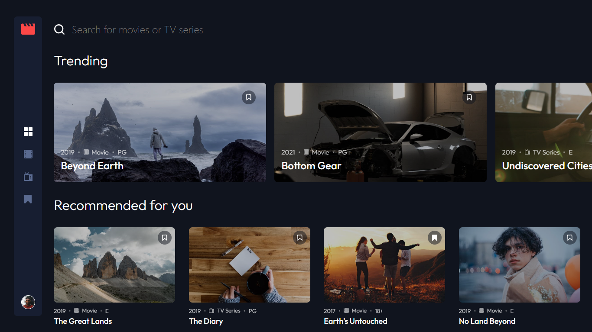

# Frontend Mentor - Entertainment web app solution

## Table of contents

- [Overview](#overview)
  - [The challenge](#the-challenge)
  - [Screenshot](#screenshot)
  - [Links](#links)
- [My process](#my-process)
  - [Built with](#built-with)
  - [What I learned](#what-i-learned)
- [Author](#author)

## Overview

### The challenge

Users should be able to:

- View the optimal layout for the app depending on their device's screen size
- See hover states for all interactive elements on the page
- Navigate between Home, Movies, TV Series, and Bookmarked Shows pages
- Add/Remove bookmarks from all movies and TV series
- Search for relevant shows on all pages

### Screenshot

### Links

- Live Site URL: [Entertainment Web App | React/TypeScript](https://entertainment-test-app.netlify.app/)

## My process

### Built with

- Semantic HTML5 markup
- CSS Modules
- Flexbox
- Mobile-first workflow
- [React](https://reactjs.org/) - JS library
- [TypeScript](https://www.typescriptlang.org/) - Js with Types
- [Zustand](https://zustand-demo.pmnd.rs/) - For State Management

### What I learned

In this project I learned the basics of using TypeScript in a full project, and also using Zustand to manage app wide state. I particularly paid close attention to writing DRY, clean, and efficient Js code

## Author

- Website - [Logan Ricard](https://www.logvnjs.dev)
- Frontend Mentor - [@LogvnR](https://www.frontendmentor.io/profile/LogvnR)
- LinkedIn - [LogvnR](https://www.linkedin.com/in/logvnr/)
